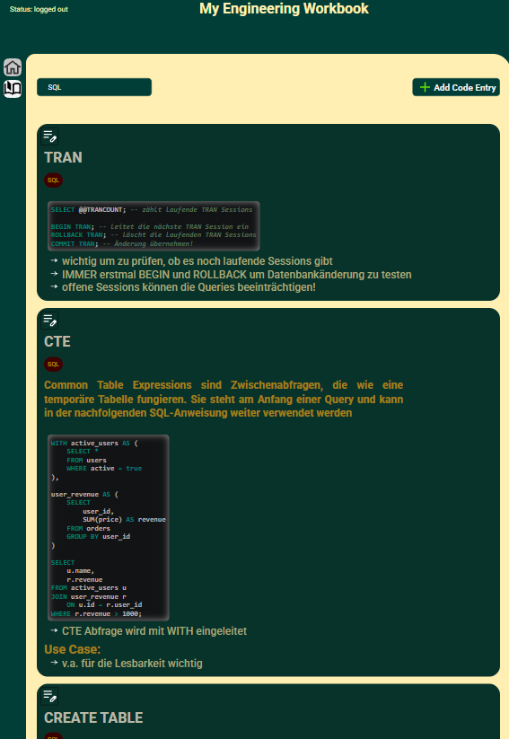
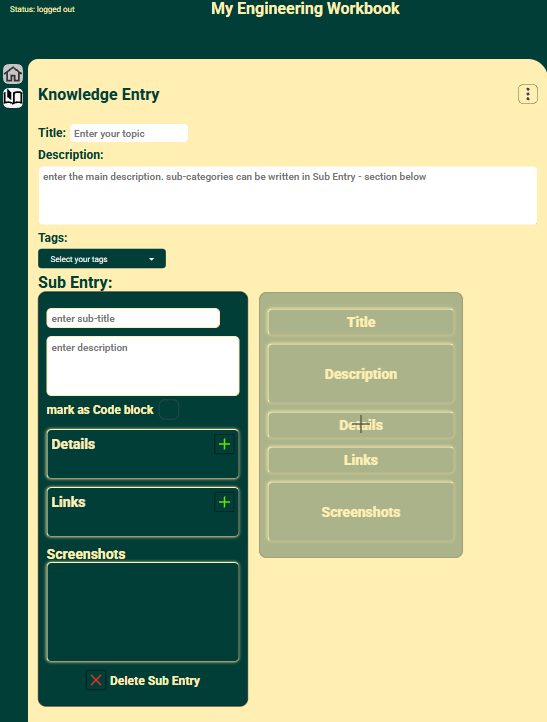
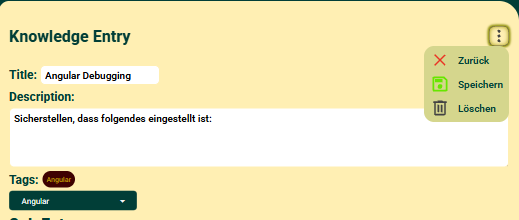
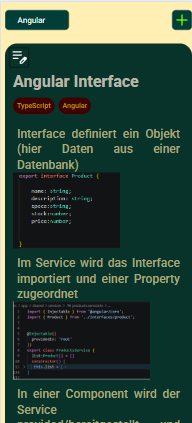

# EngineeringWorkbook

A personal knowledge platform where I document, connect, and apply what I learn about software engineering — while continuously developing the platform itself.

## About the Project

EngineeringWorkbook started from a simple problem: traditional notes and Word documents did not work well for documenting code, architectural concepts, relationships between systems, and real-world use cases.

It also felt unnatural to document software engineering outside the environment where I spend most of my time as a developer.

So instead of building another small CRUD project, I decided to create a long-term application that grows alongside my engineering skills.

The goal is not to build another MDN or framework documentation site. EngineeringWorkbook focuses on explaining concepts **in my own words and based on my own understanding**, with an emphasis on how and why they are used in real-world software.

As the project evolves, I use it to explore increasingly complex engineering topics:

- Application architecture and separation of concerns
- Technical decision-making and trade-offs
- Authentication and authorization
- Data modeling
- Testing strategies
- Maintainability and refactoring
- Frontend architecture and state management
- Performance and scalability

The application is therefore not only a knowledge base — **its architecture is also intended to reflect my growth as a software engineer.**

## Current Features

- 🔒 Email authentication
- 🛡️ Authorization and permission policies
- 📝 Create, read, update, and delete knowledge entries
- 📱 Responsive desktop and mobile interface
- 🔎 Filtering and organization of knowledge entries

## Tech Stack

- **Frontend:** Angular 22
- **Backend / Database:** Supabase
- **Authentication:** Supabase Auth
- **Database:** PostgreSQL

## Architecture

The application is structured around a clear separation of responsibilities between presentation, application logic, and data access.

As the project grows, architectural decisions and their trade-offs will be documented here rather than only reflected in the implementation.

> This section is currently evolving alongside the project.

## Engineering Goals

This project is intentionally developed beyond MVP scope. New features are used as opportunities to evaluate architecture, maintainability, testing, and alternative implementation approaches.

Some areas I plan to explore include:

- Automated testing
- Advanced search and filtering
- Relationships between knowledge entries
- Reusable UI architecture
- State management
- Database design and migrations
- CI/CD
- Deployment and monitoring

## Preview

Live Demo here: [doc.sebastian-buenz.de](https://doc.sebastian-buenz.de/)

### Overview

### New Entry

### Edit Entry

### Mobile Version

